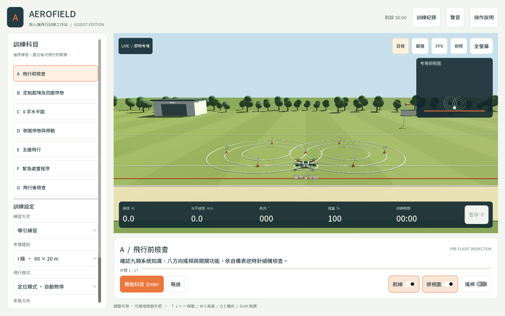

# AEROFIELD · Godot 無人機飛行訓練

以 **Godot 4.7.2 / GDScript** 重寫的繁體中文無人機訓練工作站。原生 3D 考場、A–G 七科訓練、固定 120 Hz 飛行模型、鍵盤／標準手把／觸控雙搖桿，以及本機訓練紀錄。

建立日期：**2026-10-01（Asia/Taipei）**。版本資料夾：`2026-10-01-aerofield-drone-simulator-godot-gpt-6.1-sol-high`。

v1.0.1：視窗放大改為隨螢幕比例延展，移除寬螢幕黑邊；考場全螢幕填滿整個視窗，保留儀表，退出後恢復原本的最大化狀態。



## 直接執行

到 [GitHub Releases](https://github.com/PeterHung/aerofield-drone-simulator-godot/releases) 下載對應平台；執行版不需要安裝 Godot。

| 平台 | 開啟方式 |
| --- | --- |
| macOS Apple Silicon／Intel | 解壓縮 `AEROFIELD-macOS.zip`，開啟 `AEROFIELD.app`。本機專案也可雙擊 `啟動 AEROFIELD.command`。 |
| Windows x64 | 解壓縮 `AEROFIELD-Windows.zip`，執行 `AEROFIELD.exe`。 |
| Linux x64 | 解壓縮 `AEROFIELD-Linux.zip`，執行 `./AEROFIELD.x86_64`。 |
| Web | 解壓縮 `AEROFIELD-Web.zip`，雙擊 Web 啟動器，或執行 `python3 serve_web.py --open`。預設網址 `http://127.0.0.1:8437/`。 |

macOS 套件採 ad-hoc 簽署，未使用 Apple Developer 憑證或公證；下載版本若被 Gatekeeper 阻擋，依 macOS 提示允許開啟，或用 Godot 匯入原始碼執行。

Web 版需要支援 WebGL 2 的桌面瀏覽器與 Python 3 啟動本機伺服器；不能直接以 `file://` 開啟。匯出採單執行緒，沒有 SharedArrayBuffer 的啟動需求。Windows／Linux 套件已完成跨平台匯出，尚未在實體 Windows／Linux 電腦操作。

## 用 Godot 編輯

1. 安裝 Godot 4.7.2 標準版。
2. 在 Project Manager 匯入 `project.godot`。
3. 按 **F6／F5** 執行主場景 `scenes/main.tscn`。

所有飛行、場地、介面及音效都是 Godot 原生功能。沒有 React、Node.js、Three.js 或遠端服務的執行依賴；Noto Sans TC 字型隨專案附帶。

## 訓練流程

| 科目 | 內容 |
| --- | --- |
| A | 九類系統知識、場地檢查、八方向實際搖桿輸入、所有開關與逆時針繞機。 |
| B | H 上方 1–2 m，朝外→右→內→左→外，五段各 5 秒有效停懸、四次順時針 90° 轉向，再降落 H。 |
| C | 先左逆時針、再右順時針的八字水平圓，機頭沿航線，後退返回 H 低空懸停。 |
| D | 機頭朝左／朝右，前進、後退與八段定時停懸；三級後退距離 12／18／24 m。 |
| E | 迎風前進爬升至約 20 m、中段等高、第五邊前進下降至 H 約 1–2 m，再轉向待命。 |
| F | 從當時空中位置觸發口令，立即原處懸停、口誦確認後手動進場，降落最近的八字內圈。 |
| G | 停機斷電、逆時針 360° 飛行後檢查與紀錄。 |

三級考場維持 80×20、120×30、160×40 m。可選定位模式（放桿自動煞停、抵消風漂）或姿態模式（保留風漂），以及左右來風。

**導引練習**可選科、重練、略過、切換目視／跟隨／FPV／俯視視角與顯示航線。**獨立練習**依序完成七科，鎖定目視視角並停用引導、跳科與重練。C／D／E 結束時仍須維持懸停，口誦確認後凍結待命，下一科保留當時位置。

沿用原專案的 AC107-005D P159–167 流程與使用者調整的五邊前進爬升／進場方式；本次未重新審查官方規範。S 表示**練習完成**，不等同正式鑑評成績。數字容差屬模擬設定，集中於 `TrainingData.LIMITS`。

## 操作

| 按鍵 | 功能 |
| --- | --- |
| Enter | 開始、口令確認、檢查確認、口誦結束確認、下一科 |
| Space | 啟動馬達，必須先確認開始口令 |
| W／S | 上升／下降 |
| Q／E（或 A／D） | 機頭左轉／右轉 |
| ↑／↓ | 依機頭方向前進／後退 |
| ←／→ | 依機頭方向左右平移 |
| Shift（按住） | 35% 慢速微調 |
| R | F 科監評緊急返航口令／口誦確認 |
| P | 暫停／繼續 |
| F11／Esc | 考場全螢幕／返回 |

標準手把：左搖桿高度與轉向、右搖桿前後與左右移動、A／× 確認、X／□ 緊急口令、Start／Options 暫停、LB／L1 微調。未知映射手把顯示提示，保留鍵盤操作。

勾選「搖桿」可使用滑鼠或多點觸控。視窗失焦、手把斷線或開啟對話框會暫停；返回後須放開按鍵、置中，再手動繼續。全螢幕保留高度、速度、航向、電量、時間與暫停按鈕。

## 聲音與紀錄

聲音皆預設關閉。中文語音提示、飛行／操作音效與背景音樂可分別控制，亦可全部關閉。音效與音樂由程式合成；語音使用系統提供的中文聲音。失焦時靜音並取消播報；沒有麥克風存取，口誦由本人完成後確認。

每科結果包含 S／U／N、時間、偏差分類秒數與高度偏差。一般偏差只作改善記錄，碰撞、越界、錯誤降落、錯向旋轉與緊急程序違失仍會中止。短暫微小偏差可保留停懸進度，但不累加有效停懸時間。

結果自動儲存在 Godot `user://last_training.json`。新訓練會另保留已有結果的時間戳記副本。macOS 預設資料目錄為 `~/Library/Application Support/Godot/app_userdata/AEROFIELD/`；Web 版使用瀏覽器本機儲存。重新啟動程式從新訓練開始，尚未提供載入續練介面。

「訓練紀錄 → 匯出 JSON」會另存設定、模擬容差、流程來源與逐科結果；Web 版直接下載 JSON。資料不送往遠端。

## 驗證與匯出

```sh
godot --headless --editor --import --quit
godot --headless --script tests/test_simulator.gd
godot --headless --script tests/test_ui.gd
godot --headless --script tests/test_display.gd
python3 tools/build.py --targets macos web windows linux
```

`tools/build.py` 先匯入、測試，再依 `export_presets.cfg` 匯出。需安裝同版本官方 Export Templates；也可用 `--templates /path/to/templates` 指定可攜模板，`--godot /path/to/Godot` 指定執行檔。工具會還原原有匯出設定，不把本機絕對路徑留在版本庫。

可選 GitHub Actions 範本保存在 `docs/verify-workflow.yml`。若有工作流程管理權限，可將此檔移至 `.github/workflows/verify.yml`，啟用推送／PR 自動測試。此次 GitHub OAuth 授權缺少 `workflow` scope，因此未啟用雲端 CI；本機訓練、物理控制及介面測試已通過。完整驗證範圍見 [docs/VALIDATION.md](docs/VALIDATION.md)。

## 架構與來源

| 檔案 | 責任 |
| --- | --- |
| `scripts/training_data.gd` | 科目、場地、航線、檢查表與模擬容差 |
| `scripts/simulator.gd` | 固定時間步進物理、科目狀態、判定與匯出 |
| `scripts/field_world.gd` | 原生 3D 場地、四旋翼、航線、視角 |
| `scripts/main.gd` | 繁體中文工作站與操作生命週期 |
| `scripts/flight_controls.gd` | 鍵盤／手把、精細操控與置中保護 |
| `scripts/virtual_stick.gd` | 滑鼠／多點觸控雙搖桿 |
| `scripts/training_audio.gd` | 語音與合成聲音 |
| `tests/` | 規則、安全反例與實際控制輸入的完整流程 |

功能參考：使用者指定的本機 `2026-09-20-aerofield-drone-simulator-redesign-gpt-6-astra-high`，提交 `787aab9e3938935f9a34abdeff8139d693a218f3`。本次重新實作為 GDScript，不含原網頁框架與套件。來源專案沒有修改。字型採 SIL Open Font License，詳見 `assets/fonts/OFL.txt`；Godot 執行引擎採其 MIT 授權，詳見 [Godot license](https://godotengine.org/license/)。
